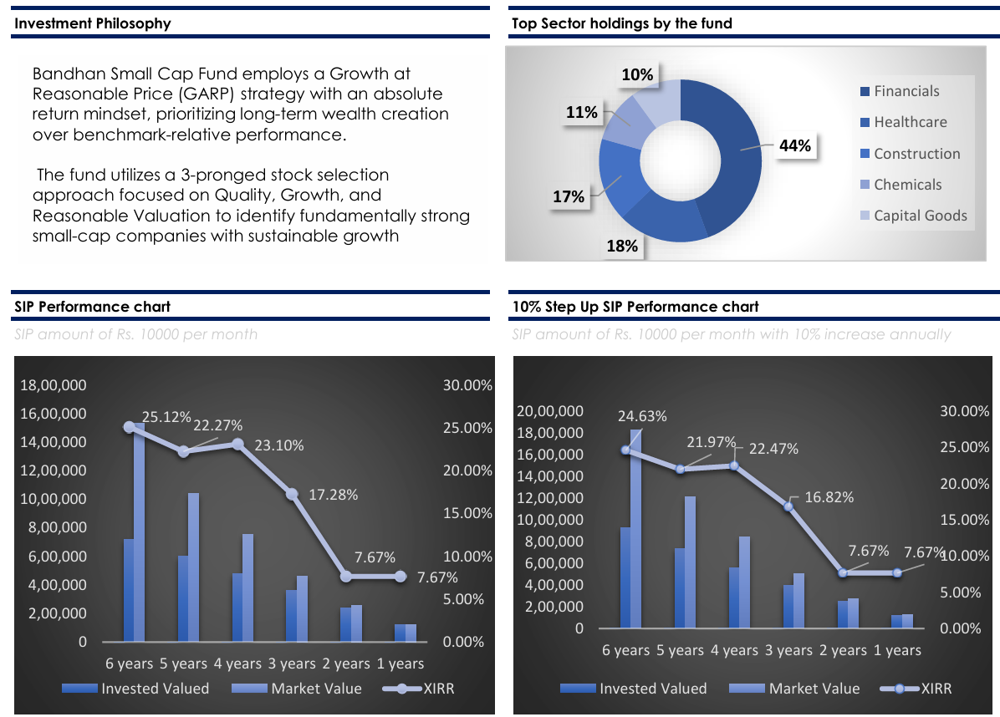
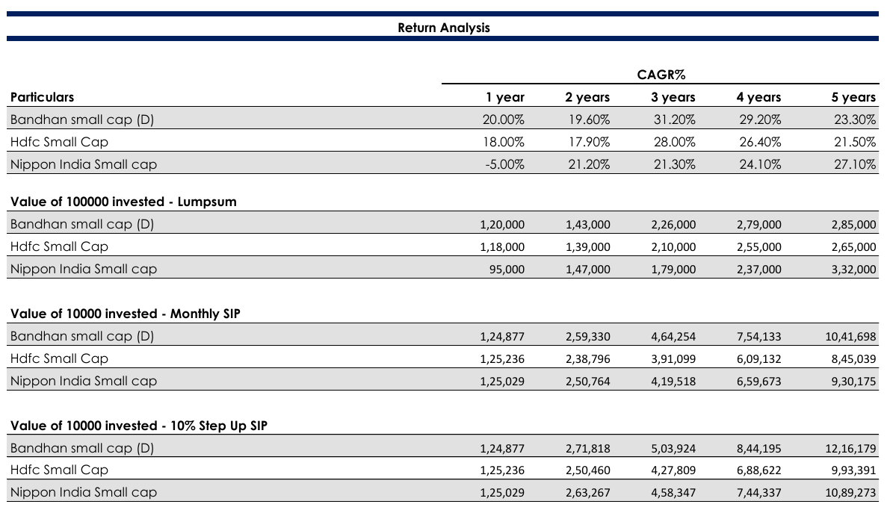

# 📊 Bandhan Small Cap Fund - Analysis Report

This repository contains a detailed **Mutual Fund Analysis Report** of the **Bandhan Small Cap Fund**, evaluating fund performance, sector allocation, investment philosophy, risk-return profile, SIP performance, and peer comparison.

The objective of this project is to assess the performance and risk characteristics of the fund through comparative analysis with peer small-cap mutual funds and investment simulation models.

---

## 📑 Report Overview

- **File Name**: `Bandhan_Small_Cap_Fund_Analysis_Report.pdf`

### 📂 Structure

- **Fund & Scheme Details**
  - Inception Date
  - AUM (Assets Under Management)
  - Expense Ratio
  - Benchmark
  - Fund Managers
  - Exit Load & Entry Load

- **Investment Philosophy**
  - Growth at Reasonable Price (GARP) Strategy
  - Quality, Growth & Valuation Framework
  - Long-Term Wealth Creation Approach

- **Portfolio Analysis**
  - Top 10 Stock Holdings
  - Sector Allocation Analysis
  - Portfolio Diversification

- **Performance Analysis**
  - CAGR Comparison
  - Lump Sum Investment Analysis
  - Monthly SIP Performance
  - 10% Step-Up SIP Performance
  - XIRR-Based Return Evaluation

- **Risk Analysis**
  - Sharpe Ratio
  - Beta
  - Standard Deviation (Risk)
  - Jensen Alpha
  - Risk vs Return Comparison

---

## 🎯 Purpose

The objective of this project is to analyze the **Bandhan Small Cap Fund** and compare its performance against competing small-cap mutual funds to understand:

- Return Consistency
- Risk-Adjusted Performance
- SIP Wealth Creation Potential
- Portfolio Allocation Strategy
- Long-Term Investment Suitability

This project demonstrates applied skills in:

- Mutual Fund Analysis
- Risk & Return Assessment
- Investment Research
- Financial Data Interpretation
- Comparative Fund Analysis
- Microsoft Excel & Report Building

---

## 🛠 Tools Used

- **Microsoft Excel** – Data analysis, visualization & calculations
- **Public Mutual Fund Data** – Historical performance and portfolio data
- **Financial Metrics** – CAGR, Sharpe Ratio, Beta, Jensen Alpha, XIRR

---

## 📊 Fund Details

| Particulars | Details |
|---|---|
| Fund Name | Bandhan Small Cap Fund |
| Asset Class | Equity |
| Scheme Type | Small Cap |
| Benchmark | BSE 250 Small Cap - TRI |
| Expense Ratio | 0.34% |
| Plan Type | Direct Plan |
| Exit Load | 1.00% |

---

## 📈 Key Highlights

### 🏢 Top Sector Holdings

- Financials – **44%**
- Healthcare – **18%**
- Construction – **17%**
- Chemicals – **11%**
- Capital Goods – **10%**

### 💼 Investment Philosophy

The fund follows a **Growth at Reasonable Price (GARP)** investment strategy with an emphasis on:

- Quality Businesses
- Sustainable Growth
- Reasonable Valuation
- Long-Term Wealth Creation

---

## 📸 Report Screenshots

### 📄 Fund Overview & SIP Performance

### 📊 Return & Risk Analysis

---

## 📌 Key Insights

- **Bandhan Small Cap Fund** delivered strong long-term CAGR performance compared to peers.
- SIP and Step-Up SIP analysis indicate significant wealth creation potential over longer investment horizons.
- Higher returns are accompanied by relatively higher risk (**Standard Deviation: 16.00**).
- Strong exposure to **Financials (44%)** indicates sector concentration.
- Better **Sharpe Ratio (1.41)** suggests superior risk-adjusted returns compared to peer funds.

---

## 📈 Peer Comparison

The report compares:

- **Bandhan Small Cap Fund**
- **HDFC Small Cap Fund**
- **Nippon India Small Cap Fund**

using:

- CAGR Analysis
- Lump Sum Returns
- Monthly SIP Returns
- Step-Up SIP Returns
- Risk vs Return Metrics

---

## 📂 How to Access

1. Download or clone the repository.
2. Open `Bandhan_Small_Cap_Fund_Analysis_Report.pdf`
3. Review:
   - Fund Overview
   - Portfolio Holdings
   - SIP Analysis
   - Risk Assessment
   - Return Comparison

---

## 📚 References

- Bandhan Mutual Fund Factsheet
- AMFI India
- Public Mutual Fund Data Sources
- Historical NAV Data

---

## 🚀 Skills Demonstrated

- Mutual Fund Research
- Financial Analysis
- Risk Assessment
- Portfolio Evaluation
- Investment Comparison
- Excel-Based Reporting
- Data Visualization

---

## ⚠️ Disclaimer

This report is created purely for **educational and portfolio purposes**. The analysis is based on publicly available information and personal research and should **not be considered investment advice**. Investors should conduct independent research or consult a financial advisor before making investment decisions.

---

## ⭐ Project Outcome

This project helped in developing a practical understanding of:

- Mutual Fund Evaluation
- SIP & Wealth Creation Analysis
- Risk-Adjusted Return Metrics
- Comparative Financial Analysis
- Investment Decision Framework
